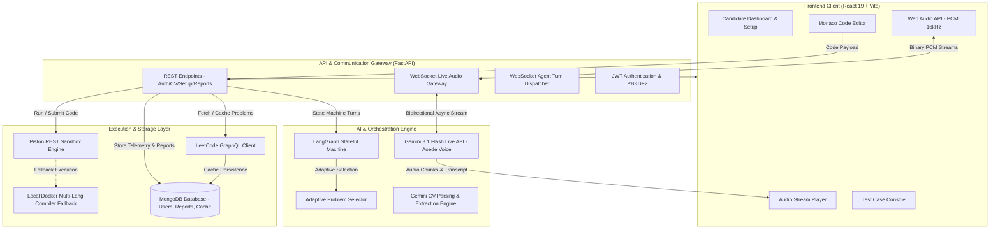
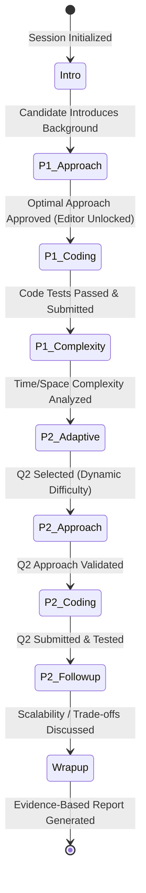
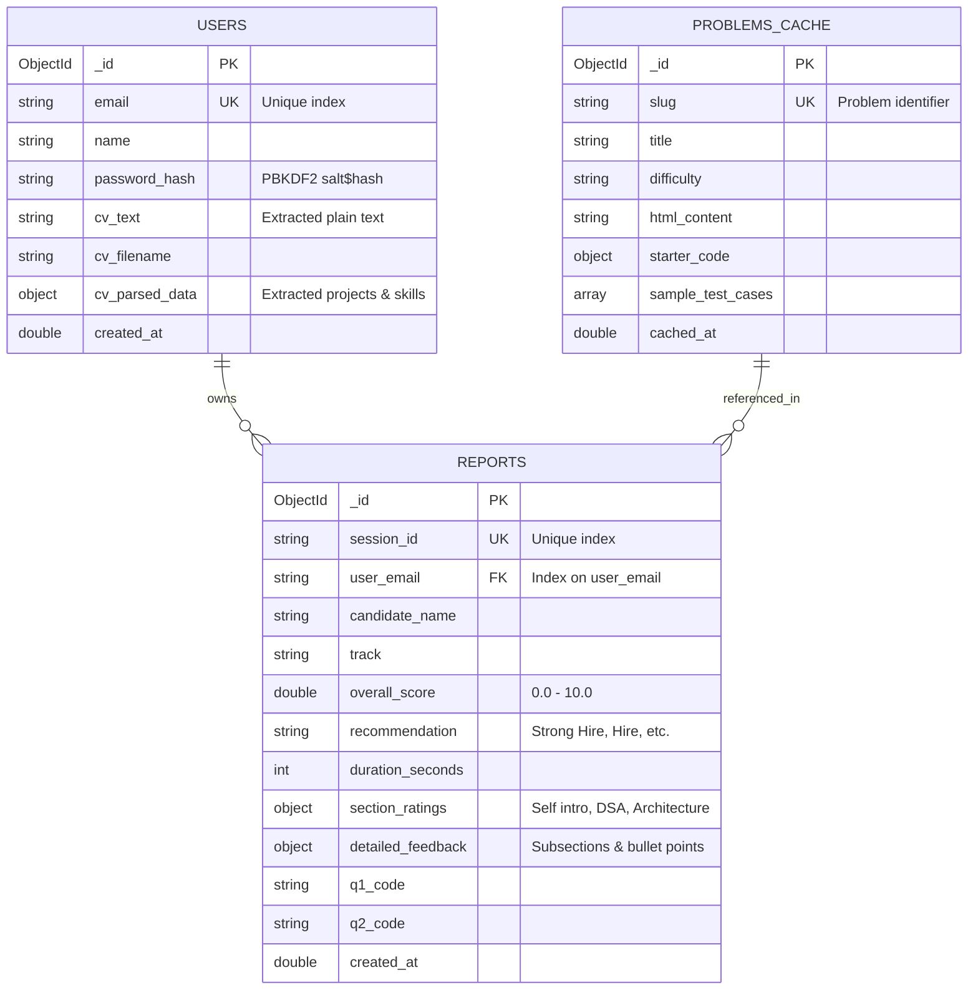

# MockMate AI: Comprehensive Engineering & Architecture Report
**Autonomous, Real-Time AI Technical & DSA Mock Interviewing Platform**

---

## Executive Summary & System Overview

**MockMate AI** is an enterprise-grade, real-time autonomous technical interview platform engineered to simulate high-stakes software engineering interviews (DSA, System Architecture, and CV/Resume Deep-Dives) with human-like fidelity. 

The platform bridges the gap between passive algorithmic practice (e.g., LeetCode, HackerRank) and expensive human mock interviews ($150–$300/hour) by pairing candidates with **"Julie"**—an intelligent, stateful AI technical interviewer powered by Google's **Gemini 3.1 Flash Live** multimodal voice model, **LangGraph** deterministic agent state machines, and a sandboxed multi-language code execution engine.

```
+------------------------------------------------------------------------------------+
|                                    MockMate AI                                    |
|                                                                                    |
|  +-------------------+      +-----------------------+      +--------------------+  |
|  |   Candidate UI    | <==> |    FastAPI Gateway    | <==> | Gemini Live Audio  |  |
|  |  (React 19, Vite) |      | (WebSockets, LangGraph|      |  (Duplex Voice)    |  |
|  +-------------------+      +-----------------------+      +--------------------+  |
|           |                             |                             |            |
|           v                             v                             v            |
|  +-------------------+      +-----------------------+      +--------------------+  |
|  | Monaco Code IDE   |      | Code Sandbox (Piston) |      | MongoDB Database   |  |
|  | (Py, C++, Java, JS|      | (Isolated Subprocess) |      | (Users, Reports)   |  |
|  +-------------------+      +-----------------------+      +--------------------+  |
+------------------------------------------------------------------------------------+
```

### Key Highlights & Differentiators
1. **Ultra-Low-Latency Full-Duplex Voice Dialogue**: Sub-300ms spoken audio streaming over WebSockets using Gemini 3.1 Flash Live Preview with native interruption (barge-in) detection.
2. **Deterministic Agent Progression**: Orchestrated via LangGraph state graphs with typed checkpoints, preventing conversational drift and ensuring standard 6-stage interview progression.
3. **Adaptive Difficulty Engine**: Dynamically recalibrates the second question's complexity (e.g., Medium to Hard, or Medium fallback) based on real-time candidate telemetry and hint dependency.
4. **CV / Resume Grilling Mode**: Automatically parses uploaded candidate resumes (PDF/DOCX/TXT), extracts architecture highlights and tech stacks, and conducts deep-dive system design interrogations.
5. **Isolated Code Execution Sandbox**: High-speed test case evaluation across Python, C++, Java, and JavaScript via Piston API with local containerized subprocess fallbacks.
6. **Evidence-Grounded Telemetry & Evaluation**: Zero-hallucination report generation that logs actual code execution errors, debugging attempts, passed test cases, and communication clarity.

---

## 1. System Architecture & High-Level Design

MockMate AI is architected around a modern microservice/modular monolith paradigm designed for horizontal scalability, sub-millisecond local state synchronization, and seamless audio/text dual-channel streaming.



### Architectural Subsystem Breakdown

| Layer | Primary Technologies | Core Responsibilities |
| :--- | :--- | :--- |
| **Presentation Tier** | React 19, Vite, Monaco Editor, Lucide | Responsive glassmorphism UI, dual-panel drag-resizable workspace, Web Audio capture, real-time audio playback, interactive score dashboard. |
| **API Gateway Tier** | FastAPI, Uvicorn, WebSockets, Python 3.11 | Authentication, session persistence, WebSocket duplex bridge, audio chunk streaming, network ping telemetry, file upload handlers. |
| **Agentic State Engine** | LangGraph, LangChain Google GenAI, StateGraph | Deterministic interview stage advancement, Socratic hint delivery, Big-O complexity evaluation, project grilling logic. |
| **Voice & LLM Tier** | Google GenAI SDK, Gemini 3.1 Flash Live | Real-time duplex voice synthesis, text-to-speech with the Aoede persona, natural interruption handling, fast JSON reasoning. |
| **Execution Sandbox** | Piston API, Subprocess, OpenJDK, G++, Node.js | Multi-language code compilation, standard input injection, timeout enforcement (3000ms), assertion validation. |
| **Persistence & Cache** | MongoDB Atlas, Pymongo, In-Memory Dict | User credentials, parsed CV embeddings, session audit logs, LeetCode question cache, final evaluation reports. |

---

## 2. Complete Technology Stack & Tooling

```
+-----------------------------------------------------------------------------------+
|                                  TECHNOLOGY STACK                                 |
+---------------------+-------------------------------------------------------------+
| Frontend Framework  | React 19.2.8, React DOM, React Router v7.18                 |
| Build & Bundler     | Vite 8.2.0, ES Modules, Oxlint                              |
| Code Editor         | Monaco Editor (@monaco-editor/react v4.7.0)                 |
| Audio & Streaming   | HTML5 Web Audio API, AudioContext, Linear PCM (16kHz, 1-Ch) |
| UI & Icons          | Vanilla CSS Modules (Glassmorphism, Dark Mode), Lucide      |
+---------------------+-------------------------------------------------------------+
| Backend Framework   | FastAPI 0.115.0, Uvicorn (Standard ASGI), WebSockets 13.0   |
| Language & Runtime  | Python 3.11-slim, AsyncIO                                   |
| Agent Framework     | LangGraph 0.2.0, LangChain Core 0.3.0, LangChain Google     |
| AI & LLMs           | Gemini 3.1 Flash Live Preview, Gemini 3.1 Flash Lite        |
| Document Extraction | PyPDF 4.0.0, Python-Multipart                               |
| Security & Auth     | PBKDF2-HMAC-SHA256 (100,000 rounds), HMAC-SHA256 JWT        |
| Sandbox & Execution | Piston REST API v2, G++ (C++17), OpenJDK 17, Node.js 18     |
| Database & Caching  | MongoDB 6.0+ (Pymongo 4.8, Motor 3.5), In-Memory Cache      |
| Containerization    | Multi-stage Debian Dockerfile, Docker Compose               |
+---------------------+-------------------------------------------------------------+
```

---

## 3. Core Engine Workflows & Technical Deep Dives

### 3.1 Stateful LangGraph Agent State Machine

Standard conversational LLMs suffer from topic drifting, premature answer leaking, and loss of structure over 30–60 minute sessions. MockMate AI resolves this using a **StateGraph** with a strongly-typed state schema (`InterviewState`).



#### State Definition (`InterviewState` Schema)
The agent state retains comprehensive context across all execution turns:
* **Candidate Context**: `session_id`, `candidate_name`, `track`, `resume_summary`, `parsed_cv`, `start_time`.
* **Dialogue & Phases**: `messages`, `current_phase`, `spoken_response`, `turn_count`.
* **Editor & Code**: `active_problem_id`, `starter_code`, `editor_code`, `language`, `editor_unlocked`.
* **Telemetry Signals**: `test_results`, `q1_stats`, `q2_stats`, `hints_history`, `debug_events`.
* **Evaluation Matrix**: `overall_score`, `recommendation`, `section_ratings`, `detailed_feedback`.

---

### 3.2 Real-Time Gemini Live Audio Gateway

The platform implements a real-time duplex voice streaming gateway in `live_gateway.py`. It establishes a WebSocket bridge between the client browser and Google's `gemini-3.1-flash-live-preview`.

```
Candidate Mic (Web Audio API)
       │ (16kHz PCM chunks via WebSocket)
       ▼
FastAPI Gateway (live_gateway.py)
       │ (types.Blob audio payload)
       ▼
Gemini Live Session (gemini-3.1-flash-live-preview)
       │
       ├─► Server Audio Turn (Aoede Voice Chunk B64) ──► Browser Audio Playback
       ├─► Output Transcription (Interviewer Speech)  ──► Real-Time Subtitles
       ├─► Input Transcription (Candidate Voice)      ──► Conversation History
       └─► Interruption Event (Barge-In Detected)     ──► Stop Audio Playback
```

1. **Audio Capturing**: Client microphone records raw PCM audio at 16,000 Hz, 16-bit mono.
2. **Duplex Concurrency**: Runs two asynchronous tasks via `asyncio.gather()`:
   * `receive_from_gemini()`: Continuously reads model audio parts, base64 encodes them, and pushes them to the client.
   * `receive_from_browser()`: Listens for candidate audio chunks, code snapshot broadcasts, or manual text inputs.
3. **Barge-In Handling**: When the user interrupts Julie, Gemini issues an `interrupted: true` signal, immediately clearing client audio buffers.

---

### 3.3 Multi-Language Code Execution Sandbox

Candidate code must run rapidly and securely without crashing the server. The execution pipeline in `sandbox.py` combines remote execution with local sandbox resilience.

```
[Candidate Code + Selected Language + Test Cases]
                        │
                        ▼
       Execute via Piston REST API (emkc.org)
                        │
         ┌──────────────┴──────────────┐
         ▼                             ▼
   [Success 200 OK]              [Network / API Fail]
         │                             │
         │                             ▼
         │                 Local Containerized Subprocess
         │                 (python3 / g++ / javac / node)
         │                             │
         └──────────────┬──────────────┘
                        ▼
          Evaluate Against Assertions
   (stdout compare, return value inspection, runtime errors)
                        │
                        ▼
         Structured JSON Results & Telemetry
```

#### Test Assertion Evaluation
* For LeetCode-style algorithmic methods (e.g. `class Solution: def twoSum(...)`), the sandbox wraps code with an automated testing harness.
* Captures standard output, execution time in milliseconds, memory limits, and exact traceback lines for compiler and runtime exceptions.

---

### 3.4 CV / Resume Parsing & Grilling Engine

The CV Grilling mode (`cv_extractor.py` & `cv_grill_nodes.py`) transforms unstructured candidate resumes into structured, interrogatable knowledge graphs.

1. **Document Ingestion**: `pypdf` extracts raw text from PDF, DOCX, TXT, or Markdown files.
2. **LLM Extraction**: `gemini-3.1-flash-lite` parses the CV into structured JSON:
   * Candidate summary & core skills.
   * Flagship projects with architectural components (databases, messaging queues, protocols).
   * Targeted **probing angles** (e.g., concurrency bottlenecks, trade-offs, failure modes).
3. **4-Stage Grilling Lifecycle**:
   * **Stage 1 (Greeting & Selection)**: Lists projects and asks candidate to choose their flagship system.
   * **Stage 2 (Flagship Deep Dive)**: 8–10 minute architectural drill down (API flows, schemas, personal contributions, tricky bugs).
   * **Stage 3 (Topic Rotation)**: Interrogates remaining projects, skills, and work history without repetition.
   * **Stage 4 (Wrap-up)**: Summarizes architectural strengths and areas for improvement.

---

### 3.5 Dynamic 3-Tier Problem Database & Adaptive Engine

The platform features an extensive catalog of algorithmic challenges categorised into three distinct interview tiers:

```
+------------------------------------------------------------------------------------+
|                                 INTERVIEW TIERS                                    |
+---------------+---------------------+----------------------------------------------+
| Easy Tier     | 2 Medium Problems   | Fundamental data structures, hashing, arrays |
| Medium Tier   | 1 Med + 1 Hard      | Optimization, DP, trees, graphs, scaling     |
| Hard Tier     | 2 Hard Problems     | Advanced algorithms, segment trees, tries    |
| CV Grill Tier | 25-30m Deep Dive    | Distributed systems, API design, trade-offs  |
+---------------+---------------------+----------------------------------------------+
```

* **Dynamic LeetCode GraphQL Connector**: Fetches live problem statements, starter codes, and test cases directly from LeetCode with local MongoDB caching.
* **Adaptive Q2 Logic**: If a candidate struggles on Q1 during a Medium-tier interview (high hint count, failed test cases), the system dynamically selects another Medium question instead of escalating to Hard, ensuring realistic calibration.

---

## 4. Database Schema & Security Architecture

### 4.1 Data Models (MongoDB)



### 4.2 Security & Authentication Pipeline
1. **Password Security**: Zero plaintext storage. Uses `PBKDF2-HMAC-SHA256` with 100,000 iterations and a 16-byte cryptographically secure random salt (`secrets.token_hex(16)`).
2. **Stateless JWT Tokens**: Signed using `HMAC-SHA256` with standard base64url encoding and a 7-day expiration window.
3. **Execution Isolation**: Code sandbox runs in restricted containers with a 3-second timeout to prevent infinite loops, fork bombs, and unauthorized network calls.
4. **CORS & Input Validation**: Strict Pydantic models validate all incoming payloads; CORS middleware restricts unauthorized origins.

---

## 5. Performance, Telemetry & Evaluation Report

### 5.1 Evidence-Grounded Scoring Rubric
At the end of an interview, Julie compiles an un-biased, evidence-based score card. Rather than relying solely on conversational summaries, the evaluation engine incorporates **real telemetry**:

* **Code Execution Timeline**: Logs all compilation errors, syntax mistakes, and runtime exceptions.
* **Test Case Assertions**: Records exact counts of sample and hidden test cases passed on Q1 and Q2.
* **Algorithmic Optimality**: Detects whether the candidate implemented brute-force ($O(N^2)$) vs. optimal ($O(N)$) approaches.
* **Communication & Big-O**: Analyzes accuracy when explaining time and space complexity.

```
+------------------------------------------------------------------------------------+
|                         CANDIDATE PERFORMANCE METRICS                              |
+------------------------------+-------+---------------------------------------------+
| Category                     | Score | Evidence & Observations                     |
+------------------------------+-------+---------------------------------------------+
| Overall Score                | 8.5   | Recommendation: Strong Hire                 |
| Problem Solving Ability      | 8.8   | Optimal two-pointer technique on Q1.        |
| Coding Cleanliness & Syntax  | 8.2   | Clean variable naming, modular structure.   |
| Communication & Complexity   | 8.5   | Correctly identified O(N) time, O(1) space. |
| Debugging & Iteration        | 8.5   | Resolved off-by-one boundary error in run 2.|
+------------------------------+-------+---------------------------------------------+
```

### 5.2 Downloadable & Printable Report Dashboard
The frontend `ReportDashboard.jsx` provides an interactive, printable report complete with:
* Executive badge summary & overall score gauge.
* Expandable section breakdowns with positive highlights and constructive gaps.
* Complete code snippets submitted for all attempted questions.
* Native browser PDF export (`window.print()`) styled for clean standard 8.5x11 printing.

---

## 6. Containerization & Deployment Guide

The platform is containerized using a multi-language Debian Docker image that installs all required runtime compilers.

### Multi-Language Dockerfile Overview
```dockerfile
FROM python:3.11-slim
ENV DEBIAN_FRONTEND=noninteractive PYTHONUNBUFFERED=1

# Install C++ (g++), Java (OpenJDK 17), Node.js, and build tools
RUN apt-get update && apt-get install -y --no-install-recommends \
    build-essential g++ default-jdk-headless nodejs npm curl \
    && rm -rf /var/lib/apt/lists/*

WORKDIR /app
COPY backend/requirements.txt .
RUN pip install --no-cache-dir -r requirements.txt
COPY backend/ .

EXPOSE 8000
CMD ["sh", "-c", "uvicorn main:app --host 0.0.0.0 --port ${PORT:-8000}"]
```

### Running Locally
```bash
# 1. Start Backend
cd backend
python -m venv venv && source venv/bin/activate
pip install -r requirements.txt
uvicorn main:app --reload --port 8000

# 2. Start Frontend
cd frontend
npm install
npm run dev
```

---

## 7. Future Roadmap & Scaling Opportunities

1. **Multimodal Computer Vision Analysis**: Track candidate eye contact, posture, and facial engagement via WebRTC camera streams to provide soft-skills coaching.
2. **Collaborative System Design Whiteboard**: Add an interactive canvas (Excalidraw/tldraw) for distributed systems architecture diagrams evaluated in real time.
3. **Enterprise ATS Integration**: Direct webhooks for Greenhouse, Lever, and Ashby to automatically trigger mock rounds and export candidate evaluation reports.
4. **Fine-Tuned Specialized Voice Models**: Domain-specific fine-tuning for specialized tracks (ML Engineering, Mobile SDE, DevOps/SRE, Security).

---

*Report compiled by MockMate AI Engineering Architecture Team.*
