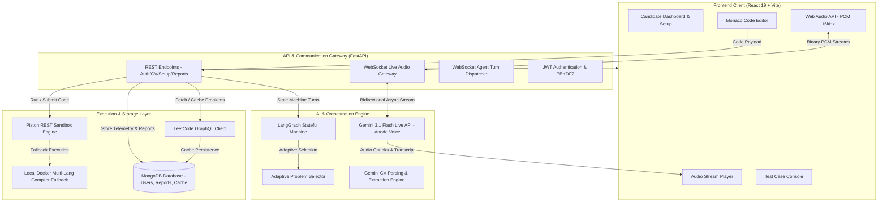

# MockMate AI 🎙️💻
### Autonomous, Real-Time AI Technical & DSA Mock Interviewing Platform

[](https://react.dev/)
[](https://fastapi.tiangolo.com/)
[](https://langchain-ai.github.io/langgraph/)
[](https://ai.google.dev/)
[](https://www.mongodb.com/)
[](https://www.docker.com/)
[](https://opensource.org/licenses/MIT)

---

## 🌟 Overview

**MockMate AI** is an enterprise-grade technical interview platform engineered to simulate real-world FAANG/Tier-1 software engineering interviews (DSA, System Architecture, and CV/Resume Deep-Dives) with human-like fidelity.

It pairs candidates with **"Julie"**—an AI Senior Technical Interviewer powered by Google's **Gemini 3.1 Flash Live** duplex voice model, **LangGraph** deterministic state machines, a multi-language execution sandbox, and evidence-grounded performance evaluation.

```
+------------------------------------------------------------------------------------+
|                                    MockMate AI                                    |
|                                                                                    |
|  +-------------------+      +-----------------------+      +--------------------+  |
|  |   Candidate UI    | <==> |    FastAPI Gateway    | <==> | Gemini Live Audio  |  |
|  |  (React 19, Vite) |      | (WebSockets, LangGraph|      |  (Duplex Voice)    |  |
|  +-------------------+      +-----------------------+      +--------------------+  |
|           |                             |                             |            |
|           v                             v                             v            |
|  +-------------------+      +-----------------------+      +--------------------+  |
|  | Monaco Code IDE   |      | Code Sandbox (Piston) |      | MongoDB Database   |  |
|  | (Py, C++, Java, JS|      | (Isolated Subprocess) |      | (Users, Reports)   |  |
|  +-------------------+      +-----------------------+      +--------------------+  |
+------------------------------------------------------------------------------------+
```

---

## ✨ Key Features

- **🎙️ Sub-300ms Duplex Spoken Dialogue**: Real-time voice interaction using `gemini-3.1-flash-live-preview` over WebSockets (16kHz PCM audio), with native voice activity and barge-in (interruption) detection.
- **🤖 Deterministic LangGraph State Machine**: Orchestrates standard 6-stage interview progression (`Intro` ➔ `P1 Approach` ➔ `P1 Coding` ➔ `P1 Complexity` ➔ `P2 Adaptive` ➔ `Wrap-up`) with typed memory checkpoints.
- **⚡ Isolated Multi-Language Code Sandbox**: High-speed test execution for **Python, C++, Java, and JavaScript** via Piston API with fallback to containerized local compiler subprocesses.
- **📄 CV / Resume Deep-Dive Grilling Mode**: Automatically parses uploaded resumes (PDF, DOCX, TXT), extracts architecture highlights and tech stacks, and runs a rigorous 25–30 min system design interrogation.
- **🎯 Dynamic LeetCode Catalog & Adaptive Difficulty**: Curated 3-tier tracks (Easy, Medium, Hard) that dynamically calibrate Question 2 difficulty based on real-time candidate telemetry and hint dependency.
- **📊 Evidence-Grounded Scoring & PDF Reports**: Zero-hallucination report generation that logs actual code execution errors, debugging attempts, passed test cases, and communication clarity with instant PDF export.
- **🔐 Secure Authentication & History**: PBKDF2-HMAC-SHA256 password hashing with random salt, stateless JWT tokens, and historical interview analytics stored in MongoDB.

---

## 🏗️ System Architecture



---

## 🛠️ Technology Stack

| Domain | Technologies |
| :--- | :--- |
| **Frontend** | React 19.2, Vite 8.2, Monaco Editor (`@monaco-editor/react`), Lucide React, HTML5 Web Audio API |
| **Backend** | FastAPI 0.115, Uvicorn (ASGI), WebSockets 13.0, Pydantic v2, Python 3.11 |
| **AI & Agentic Framework** | LangGraph 0.2, LangChain Google GenAI, Google GenAI SDK (`gemini-3.1-flash-live-preview`, `gemini-3.1-flash-lite`) |
| **Document Processing** | PyPDF 4.0, Python-Multipart |
| **Code Sandbox** | Piston REST API v2, G++ (C++17), OpenJDK 17, Node.js 18, Python 3.11 |
| **Database & Auth** | MongoDB Atlas / Local (Pymongo 4.8, Motor 3.5), PBKDF2-HMAC-SHA256, HMAC-SHA256 JWT |
| **Containerization** | Docker Multi-Language Runtime (Debian slim) |

---

## 📁 Repository Structure

```
ai_interview/
├── backend/
│   ├── agent/
│   │   ├── cv_grill_nodes.py      # CV Grilling state machine nodes & prompts
│   │   ├── graph.py               # LangGraph StateGraph & memory checkpointer
│   │   ├── nodes.py               # Standard DSA interview state nodes
│   │   ├── problem_engine.py      # Adaptive difficulty & problem generator
│   │   └── state.py               # Typed InterviewState schema
│   ├── auth.py                    # PBKDF2 hashing & JWT token management
│   ├── cv_extractor.py            # PyPDF text extractor & Gemini structured parser
│   ├── leetcode_client.py         # LeetCode GraphQL fetcher & MongoDB cache
│   ├── live_gateway.py            # WebSocket bridge for Gemini 3.1 Live Audio
│   ├── main.py                    # FastAPI server & route handlers
│   ├── problems_db.py             # 3-Tier problem repository & track mappings
│   ├── sandbox.py                 # Multi-language code runner & test harness
│   ├── Dockerfile                 # Backend container definition
│   └── requirements.txt           # Python dependencies
├── frontend/
│   ├── src/
│   │   ├── components/
│   │   │   ├── AuthModal.jsx          # Login / Registration modal
│   │   │   ├── AuthScreen.jsx         # Standalone auth screen
│   │   │   ├── HomeDashboard.jsx      # Candidate dashboard with CV & history
│   │   │   ├── PastInterviewsModal.jsx# Past report viewer
│   │   │   ├── ReportDashboard.jsx    # Evidence-grounded scorecard & PDF export
│   │   │   ├── SetupModal.jsx         # Tier selector & candidate setup
│   │   │   └── TestConsole.jsx        # Test case runners & assertion visualizer
│   │   ├── context/
│   │   │   └── AuthContext.jsx        # User state & JWT persistence
│   │   ├── App.jsx                    # Core interview IDE, audio, & state controller
│   │   ├── config.js                  # API Base URL configuration
│   │   └── main.jsx                   # Vite entry point
│   ├── package.json                   # Frontend dependencies
│   └── vite.config.js                 # Vite configuration
├── Dockerfile                         # Root multi-language production container
├── MockMate_AI_PROJECT_REPORT.md     # Comprehensive 5-page engineering whitepaper
└── README.md                          # Project documentation
```

---

## 🚀 Quick Start Guide

### Prerequisites
- **Node.js**: v18.0 or higher
- **Python**: v3.10 or higher
- **Google Gemini API Key**: [Get API Key](https://aistudio.google.com/)
- **MongoDB**: Free cluster on [MongoDB Atlas](https://www.mongodb.com/) or local MongoDB instance

---

### 1. Clone the Repository
```bash
git clone https://github.com/Shubhraj-Shubh/MockMate-AI.git
cd mock_ai_interviewer
```

---

### 2. Backend Setup
```bash
# Navigate to backend
cd backend

# Create and activate a virtual environment
python3 -m venv venv
source venv/bin/activate  # On Windows: venv\Scripts\activate

# Install dependencies
pip install -r requirements.txt

# Create .env configuration file
cp .env.example .env
```

Edit `backend/.env` with your credentials:
```env
GEMINI_API_KEY=your_gemini_api_key_here
MONGODB_URI=mongodb+srv://<username>:<password>@cluster0.xxxxx.mongodb.net/ai_interview_db?retryWrites=true&w=majority
JWT_SECRET=your_super_secret_jwt_key_2026
PORT=8000
```

Start the backend server:
```bash
uvicorn main:app --reload --port 8000
```

---

### 3. Frontend Setup
```bash
# In a new terminal, navigate to frontend
cd frontend

# Install Node dependencies
npm install

# Start Vite dev server
npm run dev
```

Visit **`http://localhost:5173`** in your browser!

---

## 🐳 Containerized Local Execution (Docker)

To build and run the multi-language production container (with Python, C++, Java, and Node.js compilers pre-installed):

```bash
# Build the Docker image
docker build -t mockmate-ai .

# Run the container
docker run -p 8000:8000 --env-file backend/.env mockmate-ai
```

---

## 🔌 API Endpoints Summary

| Method | Endpoint | Description |
| :--- | :--- | :--- |
| `POST` | `/api/auth/register` | Register a new user (PBKDF2 salted hash) |
| `POST` | `/api/auth/login` | Authenticate user & return signed JWT |
| `GET` | `/api/auth/me` | Retrieve profile for authenticated user |
| `GET` | `/api/user/cv` | Fetch uploaded CV metadata & parsed structure |
| `POST` | `/api/user/cv/upload` | Upload CV, extract text (PyPDF), and parse with Gemini |
| `POST` | `/api/setup-interview` | Initialize tailored session & select problem track |
| `GET` | `/api/problem/{id}` | Retrieve problem statement & starter code in requested language |
| `POST` | `/api/run-code` | Execute code against sample test cases (Piston / Local) |
| `POST` | `/api/submit-solution` | Evaluate code against full hidden test suite |
| `POST` | `/api/agent-turn` | Advance LangGraph agent turn and get spoken response |
| `POST` | `/api/end-interview` | Conclude session & synthesize evidence-based evaluation report |
| `GET` | `/api/user/interviews` | Fetch past interview reports for candidate dashboard |
| `WS` | `/ws/live-interview/{id}` | Bidirectional WebSocket for Gemini 3.1 Flash Live voice |

---

## 📄 Detailed Documentation

For an in-depth 5-page architectural breakdown, state machine logic, and security analysis, refer to:
📖 **[MockMate_AI_PROJECT_REPORT.md](MockMate_AI_PROJECT_REPORT.md)**

---

## 📜 License

This project is licensed under the **MIT License** - see the [LICENSE](LICENSE) file for details.


---
*Verified local production build & technical architecture documentation updated as of September 2026.*
